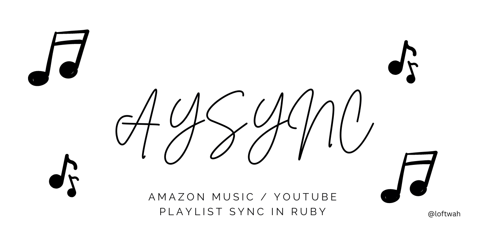

# Amazon Music and YouTube playlist sync

Sync a playlist on Amazon Music with YouTube using GitHub Actions.

I am determined to use Amazon Music and this makes it possible to sync a playlist with YouTube.

## Usage

This configuration will run the script `app.rb` on a schedule (every day at 12:00 PM, in this case) using GitHub Actions and set the environment variables `AMAZON_EMAIL`, `AMAZON_PASSWORD`, `AMAZON_PLAYLIST_ID`, and `YOUTUBE_API_KEY` to the values of the corresponding secrets in the Secrets store.

- Create the following secrets in your repository's Secrets store:

    `AMAZON_EMAIL`
    `AMAZON_PASSWORD`
    `AMAZON_PLAYLIST_ID`
    `YOUTUBE_API_KEY`

- Replace the contents of `.github/workflows/sync.yml with the above configuration.
- Commit and push the changes to your repository. The script will run on the schedule specified in the configuration.
